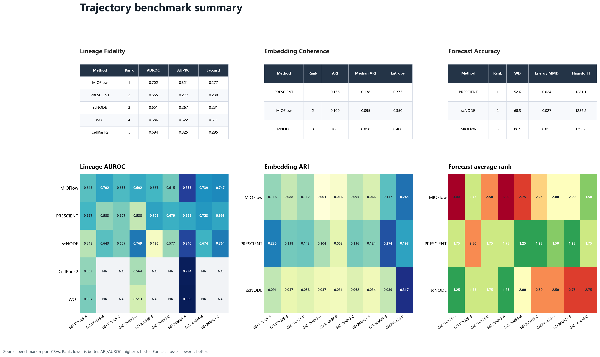

# Trajectory 结果可视化汇总

生成自当前本地 benchmark report CSVs。

## 当前汇总规模

- Lineage Fidelity: 33 runs
- Embedding Coherence: 27 runs
- Forecast Accuracy: 27 exact-mode runs

## 主要结论

1. 当前图已合并 GSE178325、GSE230659 和 GSE242424 三组数据。
2. WOT 和 CellRank2 仍为 lineage-only 方法，因此只进入 Lineage Fidelity，不进入 Embedding、Forecast 或 Emb+Lineage combined rank。
3. Forecast heatmap 使用每个 dataset/scenario 内四个 forecast loss 排名的平均值，即 scTimeBench-style averaged rank。
4. 顶部 method summary 是合并后重新计算的跨场景均值和总体排名。

## Projection-capable Combined Summary

| Method    |   Emb+Lin rank |   Embedding rank |   Lineage rank |   Forecast rank |   Embedding ARI |   Lineage AUROC |   Forecast WD |
|:----------|---------------:|-----------------:|---------------:|----------------:|----------------:|----------------:|--------------:|
| MIOFlow   |              1 |                2 |              1 |               3 |           0.1   |           0.702 |          86.9 |
| PRESCIENT |              2 |                1 |              2 |               1 |           0.156 |           0.655 |          52.6 |
| scNODE    |              3 |                3 |              3 |               2 |           0.085 |           0.651 |          68.3 |

## Lineage Fidelity Summary

| Method    |   Rank |   AUROC |   AUPRC |   Jaccard |
|:----------|-------:|--------:|--------:|----------:|
| MIOFlow   |      1 |   0.702 |   0.321 |     0.277 |
| PRESCIENT |      2 |   0.655 |   0.277 |     0.23  |
| scNODE    |      3 |   0.651 |   0.267 |     0.231 |
| WOT       |      4 |   0.686 |   0.322 |     0.311 |
| CellRank2 |      5 |   0.694 |   0.325 |     0.295 |

## Embedding Coherence Summary

| Method    |   Rank |   ARI |   Median ARI |   Entropy |
|:----------|-------:|------:|-------------:|----------:|
| PRESCIENT |      1 | 0.156 |        0.138 |     0.375 |
| MIOFlow   |      2 | 0.1   |        0.095 |     0.35  |
| scNODE    |      3 | 0.085 |        0.058 |     0.4   |

## Forecast Accuracy Summary

| Method    |   Rank |   WD |   Energy MMD |   Hausdorff |
|:----------|-------:|-----:|-------------:|------------:|
| PRESCIENT |      1 | 52.6 |        0.024 |      1281.1 |
| scNODE    |      2 | 68.3 |        0.027 |      1286.2 |
| MIOFlow   |      3 | 86.9 |        0.053 |      1396.8 |
