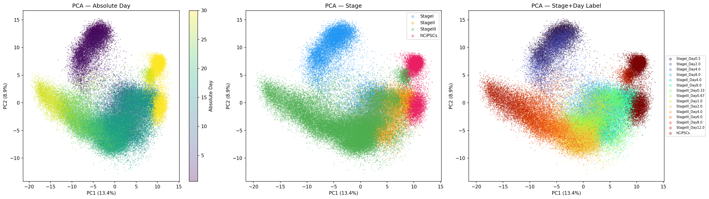
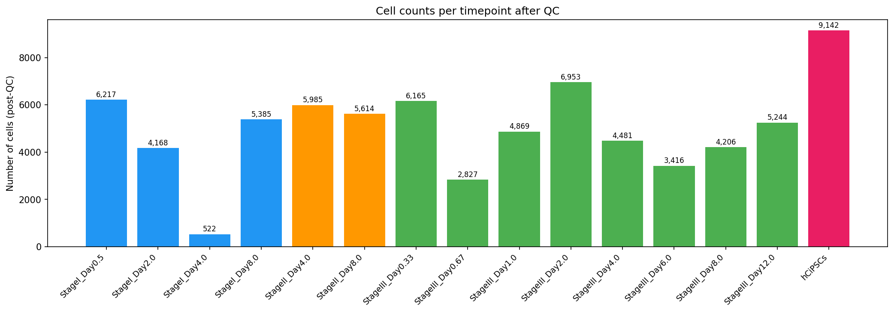
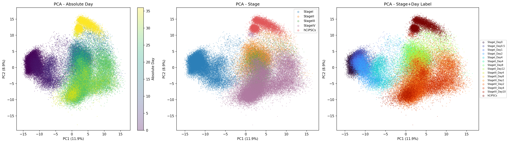
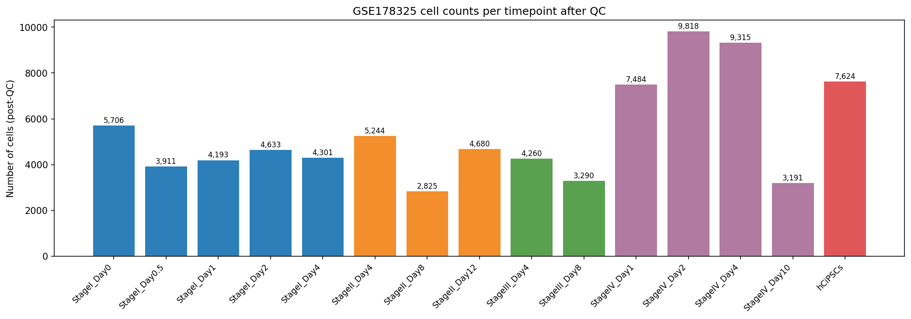
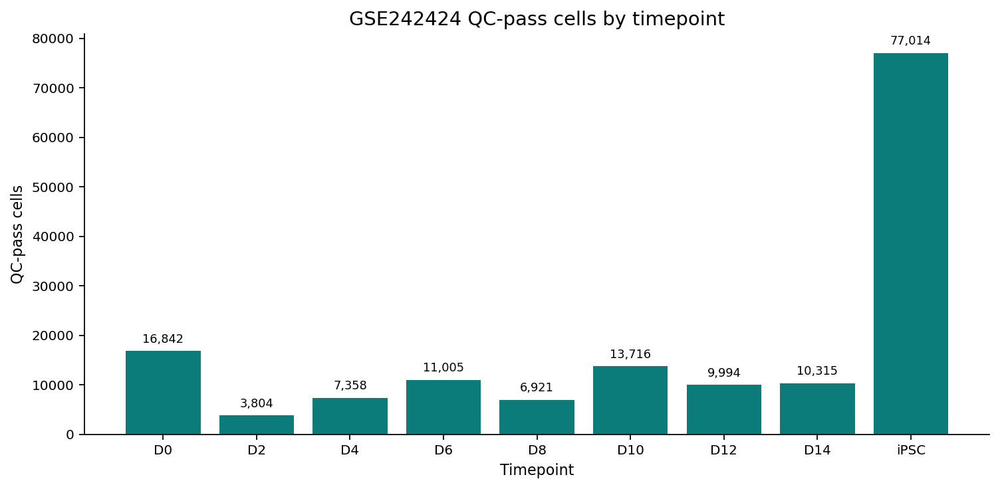
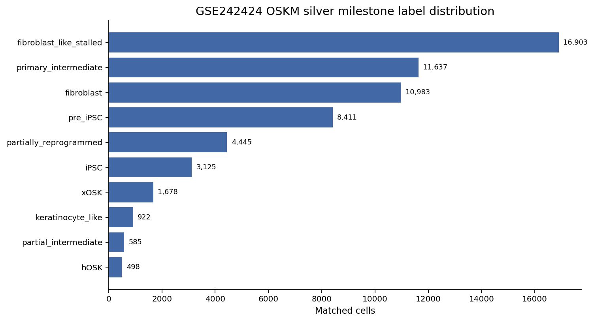
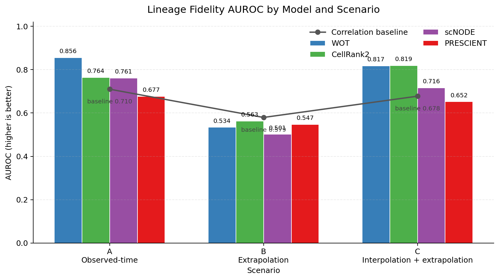
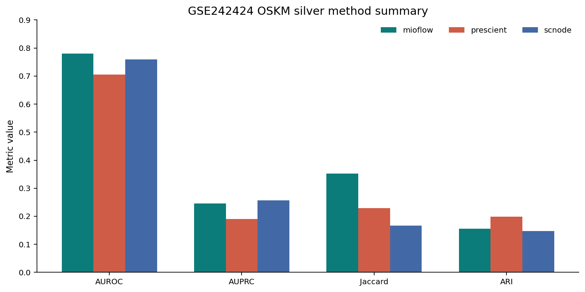
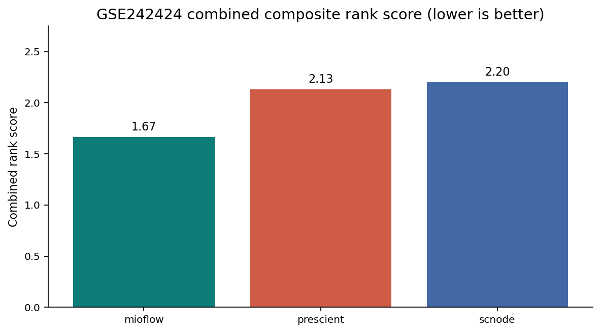

# 导师汇报材料：iPSC / OSKM reprogramming trajectory benchmark

这份材料的目标不是简单展示“我跑了哪些模型、哪个模型第一”，而是向导师解释这个项目的设计逻辑：

> 在真实 lineage ground truth 不可直接获得的 reprogramming 单细胞时间序列中，如何构造一个可复现、可质疑、可扩展、且对不同方法公平的 trajectory benchmark？

建议汇报时间：15-20 分钟。  
建议主线：**科学问题 -> 数据和 QC -> silver reference -> scenario 设计 -> 方法能力 gating -> 三类指标 -> ranking 规则 -> 当前结果 -> 需要导师判断的问题**。

---

## 0. 汇报开场：我希望导师帮我判断什么

**建议开场白：**

> 我目前完成的主要工作是搭建一个面向 iPSC / reprogramming trajectory 的 benchmark 框架。这个框架参考 scTimeBench 的评价思想，但针对我们的数据重新设计了 state system、reference graph、method capability gating 和结果汇总方式。今天我想重点请老师判断三件事：第一，silver milestone reference 是否生物学合理；第二，三类指标是否能公平反映不同方法的能力；第三，下一步应该把工作推进成 benchmark 论文，还是基于 benchmark 结果做方法改进。

**导师需要听懂的核心贡献：**

1. 我不是只复现单个 trajectory 方法，而是在构造一个评测体系。
2. 这个体系把“表达分布预测”“状态结构保持”“谱系边恢复”拆成三个问题。
3. 不同方法输出能力不同，所以不能强行用同一套指标评价所有方法。
4. 由于没有真实 lineage ground truth，reference 是 frozen silver standard，必须主动讨论其生物学合理性和局限。

---

## 1. 项目为什么需要这样设计

### 1.1 生物学和计算问题

**问题背景：**

reprogramming 单细胞数据有时间顺序，但通常缺少直接观测到的真实 cell lineage。很多 trajectory 方法可以给出动态预测、细胞状态转移或未来时间点的 projected cells，但它们的输出形式不同，不能直接用一个简单 accuracy 评价。

**因此 benchmark 需要同时回答三个层次的问题：**

| 问题层次 | 具体问题 | 对应评价维度 |
|---|---|---|
| 表达分布是否预测对了 | 模型生成的未来/held-out cells 是否接近真实观察到的细胞分布？ | Forecast Accuracy |
| 状态结构是否保留 | projected cells 在 embedding space 中是否仍能形成合理 biological state structure？ | Embedding Coherence |
| 谱系方向是否恢复 | 模型预测的 state transitions 是否接近 frozen reference lineage graph？ | Lineage Fidelity |

**为什么不只看一个指标：**

单一指标会混淆不同能力。例如，一个方法可能很好地拟合表达分布，但无法恢复 reference graph；另一个方法可能不能生成新细胞，但能给出可解释的 transition structure。因此项目必须拆成多个评价面。

---

## 2. 整体 benchmark pipeline：每一步为什么这样设计

### Slide 建议：一张 pipeline 图

```text
Raw / processed scRNA-seq time series
        |
        |  为什么：保证模型输入不是未经检查的矩阵
        v
QC + HVG2000 benchmark input
        |
        |  为什么：统一特征空间，减少不同方法因输入维度不同产生的不公平
        v
Frozen silver milestone labels
        |
        |  为什么：没有真实 lineage labels，需要一个可复现的 benchmark state abstraction
        v
Reference lineage graph
        |
        |  为什么：Lineage Fidelity 需要固定的 state-transition 目标
        v
Scenario A/B/C method runs
        |
        |  为什么：分别测试 observed-time、future extrapolation、mixed split
        v
Capability-gated evaluators
        |
        |  为什么：只在方法真正支持的输出上评价，避免人为制造伪任务
        v
Forecast / Embedding / Lineage metrics
        |
        |  为什么：把表达预测、状态结构、谱系恢复分开解释
        v
Within-scenario ranks + summary
```

### 2.1 为什么使用 HVG2000 input

**设计目的：**

- 让 MIOFlow、PRESCIENT、scNODE 等方法在可承受的计算规模下运行；
- 保持不同方法输入特征空间一致；
- 让 projected expression 的后续 embedding / annotation 也在相同 gene universe 下执行。

**需要说明的限制：**

HVG2000 不是 full transcriptome。某些 marker 或 rare-state signal 可能被弱化。因此结果更适合作为 benchmark comparison，而不是直接等价于完整生物学解释。

### 2.2 为什么使用 observed-time scenarios A/B/C

| Scenario | 设计 | 想测试的能力 |
|---|---|---|
| A | 使用所有 observed timepoints 做训练/评价 | 方法在完整时间轴上是否能重构动态结构 |
| B | 训练早期时间点，hold out later timepoints | 方法是否能外推未来 reprogramming states |
| C | 同时 hold out 中间和最后时间点 | 方法是否兼具插值和外推能力 |

**为什么暂时不主打 pseudotime scenarios D-F：**

当前主要数据集缺少跨时间点 biological/technical replicates。若 pseudotime 从同一套 time-confounded expression matrix 中推断，再拿来评价 trajectory，独立性会比较弱。因此 D-F 更适合作为后续 supplementary work，而不是当前主结果。

---

## 3. 数据和 QC：为什么这一部分必须先讲

导师首先会关心：benchmark 的输入数据是否可靠。如果数据本身有明显 batch/timepoint imbalance 或 QC 问题，后续模型 ranking 就不可信。

### 3.1 当前纳入的数据集

| Dataset | Role | Benchmark cells / matched cells | Timepoints | 当前用途 |
|---|---:|---:|---|---|
| GSE230659 | primary benchmark | 75,194 official-silver labeled cells | 15 stage/day labels in QC summary | human chemical reprogramming 主 benchmark |
| GSE178325 | external validation | 80,475 official-silver labeled cells | 15 stage/day labels in QC summary | 独立 validation |
| GSE242424 | OSKM extension | 59,187 author-cluster-matched cells; 156,969 local QC-pass cells | 9 timepoints | 检验框架能否扩展到 OSKM fibroblast reprogramming |

### 3.2 QC 可视化需要保留

**GSE230659 QC:**





**GSE178325 QC:**





**GSE242424 QC / matched subset:**



### 3.3 讲解 QC 时要说什么

**建议表述：**

> 这些 QC 图不是装饰，而是 benchmark 解释的一部分。trajectory benchmark 很容易受到 timepoint cell number、library quality 和 time-stage confounding 的影响。因此我在展示模型结果前，先展示每个数据集的 timepoint coverage、cell count distribution 和 PCA time structure，目的是让老师判断这些数据是否适合承担 trajectory evaluation。

**希望导师帮忙判断：**

- 是否需要对 cell counts 做 downsampling 或 timepoint balancing？
- 某些时间点是否由于 QC 或细胞数问题不适合纳入主要评价？
- GSE242424 的 iPSC timepoint cell count 很大，但 matched subset 中 iPSC 数量较少，这是否会影响 OSKM benchmark 的解释？

---

## 4. Silver labels 和 reference graph：为什么不直接用 cluster 或 cell type

### 4.1 设计动机

真实 lineage ground truth 不存在，原始 cluster label 又不一定等价于 reprogramming milestone。因此项目需要一个中间层：

> frozen silver-standard milestone state system

它的作用不是宣称“这就是真实生物学谱系”，而是提供一个版本固定、可复现、可替换、可做 sensitivity analysis 的 benchmark reference。

### 4.2 为什么要 frozen

如果 labels 或 reference graph 在模型评价过程中不断改变，benchmark ranking 就不可复现。Frozen provider 的作用是：

- 固定 state label 文件；
- 固定 state metadata；
- 固定 reference graph edges；
- 固定 provider ID、label mode、cell state key；
- 让所有 method 在同一个评价目标上比较。

### 4.3 当前 official-silver providers

| Dataset | Provider | State key | Cells | States | Edges | 设计来源 |
|---|---|---|---:|---:|---:|---|
| GSE178325 | `gse178325_marker_fm_transition_silver_v1` | `final_milestone_label_coarse` | 80,475 | 5 | 4 | marker / foundation-model / trajectory-aware milestone |
| GSE230659 | `gse230659_marker_fm_transition_silver_v1` | `final_milestone_label_coarse` | 75,194 | 4 graph states; 3 observed label classes | 3 | marker / foundation-model / trajectory-aware milestone |
| GSE242424 | `gse242424_oskm_reprogramming_silver_v1` | `final_milestone_label_coarse` | 59,187 | 10 | 9 | author ATAC-to-RNA cluster transfer |

### 4.4 GSE178325 reference graph

```text
hADSCs -> epithelial_like
epithelial_like -> intermediate_plastic
intermediate_plastic -> xen_like
xen_like -> hCiPS
```

Label distribution:

| State | Cells |
|---|---:|
| epithelial_like | 67,817 |
| hADSCs | 5,706 |
| intermediate_plastic | 4,654 |
| hCiPS | 2,144 |
| xen_like | 154 |

**设计含义：**

这个 graph 明确保留 `xen_like` intermediate。它适合讨论 GSE178325 是否包含 XEN-like branch / intermediate state。

### 4.5 GSE230659 reference graph

```text
hADSCs -> epithelial_like
epithelial_like -> intermediate_plastic
intermediate_plastic -> hCiPS
```

Observed label distribution in current label file:

| State | Cells |
|---|---:|
| epithelial_like | 67,112 |
| hCiPS | 5,370 |
| intermediate_plastic | 2,712 |

**重要解释：**

GSE230659 的 active order 中保留 `hADSCs` 作为 conceptual starting milestone，但当前官方 label 文件没有分配出 hADSCs，因为可用最早时间点是 Day 0.5，而不是 Day 0。这不是一个可以忽略的小细节，汇报时应该主动拿出来请导师判断：

- 是否保留 hADSCs 作为 reference graph 的 conceptual start？
- 还是在 GSE230659 主评价中将 graph 改成 `epithelial_like -> intermediate_plastic -> hCiPS`？
- 如果保留，Lineage Fidelity 中涉及 hADSCs 的边应如何解释？

### 4.6 GSE242424 OSKM reference graph

```text
fibroblast -> fibroblast_like_stalled
fibroblast -> keratinocyte_like
fibroblast -> hOSK
hOSK -> partial_intermediate
partial_intermediate -> partially_reprogrammed
fibroblast -> xOSK
xOSK -> primary_intermediate
primary_intermediate -> pre_iPSC
pre_iPSC -> iPSC
```

Label distribution:



**设计含义：**

GSE242424 的 graph 与 GSE178325/GSE230659 不同，因为它来自 OSKM fibroblast reprogramming，包含 productive arms、partial branch、stalled/off-target branches。它适合展示 benchmark 框架不是只能用于一个固定 state system，而是可以根据数据集定义不同 frozen provider。

**需要导师判断：**

- hOSK / xOSK 两条 arms 是否是合理的 coarse milestone abstraction？
- stalled 和 keratinocyte-like branch 应作为 reference graph 中的正式边，还是只作为 off-trajectory diagnostics？
- author ATAC-to-RNA cluster transfer label 是否足以作为 silver reference，还是需要 marker validation？

---

## 5. Projected-cell annotation：为什么要做 provider agreement audit

### 5.1 设计动机

对 MIOFlow、PRESCIENT、scNODE 这类会生成 projected cells 的方法，Embedding Coherence 和部分 lineage aggregation 需要给 projected cells 赋予 milestone labels。

如果只用单一 annotation provider，结果可能被 provider bias 主导。因此项目采用 two-provider / agreement-aware 逻辑：

```text
projected_expression.npy
        |
        v
HVG2000 PCA logistic-regression embedding provider
        +
CellTypist classifier provider
        |
        v
agreement -> consensus label
disagreement -> ambiguous
```

### 5.2 为什么 disagreement 设为 ambiguous

这是一个保守策略。它避免在两个 provider 冲突时强行给出确定 label，从而降低“看似高 confidence 但实际不可解释”的风险。

**GSE230659 scNODE projected-cell audit:**

| Scenario | Projected cells | Provider exact match | Ambiguous fraction | Interpretation |
|---|---:|---:|---:|---|
| A | 30,000 | 0.814 | 0.186 | annotation relatively stable |
| B | 18,000 | 0.658 | 0.342 | hardest future extrapolation setting |
| C | 10,000 | 0.962 | 0.038 | most stable provider agreement |

**汇报时要说：**

> Scenario B 的 ambiguous fraction 最高，说明外推未来细胞时，不只是模型预测难，连 projected-cell annotation 本身也更不稳定。因此 B 的结果应该被解释为 extrapolation + annotation uncertainty 的共同压力测试。

---

## 6. Method capability gating：为什么不能所有方法一起算所有指标

### 6.1 设计原则

项目采用 scTimeBench-style method eligibility rule：

> 方法只有在真正产生某类输出时，才进入对应评价维度。

### 6.2 当前方法能力

| Method | Produces projected expression/cells | Produces projected embedding | Can infer lineage/transition | Eligible dimensions |
|---|---:|---:|---:|---|
| MIOFlow | yes | yes | yes | Forecast + Embedding + Lineage |
| PRESCIENT | yes | yes | yes | Forecast + Embedding + Lineage |
| scNODE | yes | yes | yes | Forecast + Embedding + Lineage |
| WOT | no | no | yes | Lineage only |
| CellRank2 | no | no | yes | Lineage only |

### 6.3 为什么这样更公平

如果强行让 WOT 或 CellRank2 生成 projected future cells，就需要人为加一个 synthetic projection adapter。这样评价的可能是 adapter，而不是原方法。相反，把它们限定在 Lineage Fidelity，可以保留它们作为 transition-inference baseline 的价值。

**汇报时的关键句：**

> 缺少 Forecast/Embedding 结果不是 WOT 和 CellRank2 的运行失败，而是由方法定义决定的 intentional skip。

---

## 7. 三类指标分别想说明什么

这一节是汇报的重点。不要只说指标名字，要解释每个指标回答的问题和不能回答的问题。

### 7.1 Forecast Accuracy：预测的表达分布像不像真实未来细胞

**评价对象：**

projected expression at held-out or future timepoints vs observed cells at the same target timepoints.

**它想说明：**

模型是否能生成与真实目标时间点表达分布相近的细胞群。

| Metric | 越大/越小越好 | 想说明什么 | 解释时的注意点 |
|---|---|---|---|
| Wasserstein Distance | lower better | predicted distribution 到 observed distribution 的 transport-style 距离 | 对整体分布位置和形状敏感，适合描述 generated cells 是否接近真实细胞 |
| Gaussian MMD | lower better | 用 Gaussian kernel 比较两个分布是否相似 | 关注 kernel space 下的分布差异，数值尺度不宜跨数据集直接比较 |
| Energy Distance MMD | lower better | 更全局的 distribution discrepancy | 可作为 Wasserstein 的补充 |
| Hausdorff Loss | lower better | 最坏情况下 projected cells 和 observed cells 的最近邻距离 | 对 outliers 敏感，能暴露少数严重偏离的预测 |

**它不能说明：**

Forecast Accuracy 高，不一定说明模型恢复了正确 lineage graph；它只说明表达分布相似。

### 7.2 Embedding Coherence：预测细胞是否保留生物状态结构

**评价对象：**

projected cells / projected embeddings 中的 unsupervised clusters vs silver milestone labels。

**当前实现逻辑：**

```text
projected_embedding.npy
        |
        v
kNN graph + Leiden clustering
        |
        v
compare clusters with final_milestone_label_coarse
```

**为什么不用 projected_cluster_labels.csv 直接比较：**

因为那样容易出现 self-comparison artifact。如果 projected_cluster_labels 已经来自 milestone annotation，再用它和 milestone labels 比较，ARI 会虚高。当前设计从 projected embedding 重新做 Leiden clustering，再和 silver labels 比较，更接近 scTimeBench 的逻辑。

| Metric | 越大/越小越好 | 想说明什么 | 解释时的注意点 |
|---|---|---|---|
| Adjusted Rand Index (ARI) | higher better | projected embedding 中无监督 cluster 是否对应 silver milestone states | 当前 ARI 绝对值偏低，应作为相对 coherence diagnostic；最好后续加入 permutation/null |
| Mean normalized entropy | lower better | projected cells 的 state probability 是否更确定 | 低 entropy 表示 annotation/confidence 更集中，但可能也反映过度塌缩 |
| Weighted entropy | lower better | 按细胞或状态权重后的 uncertainty | 用来避免大类完全主导解释 |

**它不能说明：**

Embedding Coherence 高，不代表 projected expression 完全真实，也不代表 lineage direction 正确。

### 7.3 Lineage Fidelity：预测的状态转移是否接近 reference graph

**评价对象：**

method-derived state transition matrix / predicted lineage graph vs frozen reference lineage graph。

**它想说明：**

方法是否能恢复 benchmark 定义的 coarse milestone transition structure。

| Metric | 越大/越小越好 | 想说明什么 | 解释时的注意点 |
|---|---|---|---|
| AUROC | higher better | 所有可能 state pairs 中，reference edges 是否总体得到更高 score | 在负边很多时可能看起来较高 |
| AUPRC | higher better | 在 reference edges 稀疏时，预测高分边是否真正命中正边 | 对稀疏 graph 更有解释力 |
| Jaccard top-k | higher better | 预测 top-k edges 和 reference edges 的重叠程度 | 更接近“图结构是否命中”的直观指标 |
| Single-step recovery | higher better | reference 中直接相邻的 transition 是否被恢复 | 衡量局部转移边 |
| Multi-step recovery | higher better | 较长路径或间接 lineage relation 是否被恢复 | 衡量 coarse trajectory path 的连通性 |

**它不能说明：**

Lineage Fidelity 高，说明方法符合 frozen silver graph，但不能单独证明 recovered lineage 是真实生物谱系。这个 caveat 必须主动讲。

### 7.4 为什么需要 correlation baseline

Lineage Fidelity 必须包含 scTimeBench-style correlation baseline。原因是：

> 如果一个简单的 expression similarity baseline 就能恢复 reference graph，那么复杂 trajectory 方法必须证明自己提供了 baseline 之外的增益。

这对 GSE230659 尤其重要，因为 timepoint 与 library effect 可能 confound。导师可能会非常关心这一点。

---

## 8. Ranking 和 summary：为什么不能只给一个大表

### 8.1 Ranking 规则

当前 ranking 采用 within-dataset / within-scenario / within-provider 的 rank aggregation：

1. 在同一个 dataset、scenario、result class、provider、label mode 内比较方法；
2. 对每个 metric 排名；
3. 同一 metric family 内平均 rank，得到 Forecast / Embedding / Lineage rank；
4. 只有同时 eligible 的方法才进入 combined rank；
5. WOT / CellRank2 只报告 Lineage Fidelity rank，不进入 Forecast/Embedding/combined rank。

### 8.2 为什么用 rank 而不是直接平均 raw metric

不同 metric 的尺度不同。例如 Wasserstein、ARI、AUPRC、entropy 不能直接求平均。Rank aggregation 的好处是：

- 避免数值尺度不一致；
- 保持 within-scenario comparison；
- 让高低方向不同的指标可以统一汇总。

**缺点也要承认：**

- rank 会丢失 effect size；
- 小差异可能被放大；
- 当前多数 formal result 还缺少 seed variance，因此小的 rank 差异不能被过度解释。

---

## 9. 当前结果应该如何展示和解释

### 9.1 GSE178325 + GSE230659 official-silver summary

**Combined summary over projection-capable methods:**

| Rank | Method | Combined rank score | Mean ARI | Mean weighted entropy | Mean AUPRC | Mean AUROC | Mean Jaccard |
|---:|---|---:|---:|---:|---:|---:|---:|
| 1 | PRESCIENT | 1.7333 | 0.1150 | 0.2430 | 0.1819 | 0.4332 | 0.0667 |
| 2 | MIOFlow | 1.7389 | 0.0712 | 0.2928 | 0.1855 | 0.4129 | 0.1000 |
| 3 | scNODE | 1.7611 | 0.0767 | 0.1740 | 0.1785 | 0.3898 | 0.0667 |

**解释方式：**

不要说“PRESCIENT 明确胜出”。更稳妥的解释是：

> 三个 projection-capable methods 的 combined rank 非常接近。PRESCIENT 以很小优势排第一，MIOFlow 的 Lineage Fidelity 最强，scNODE 的 Embedding Coherence rank 最好。当前结果更支持“不同方法有不同 tradeoff”，而不是一个绝对 winner。

### 9.2 Dimension-specific result

**Embedding Coherence:**

| Rank | Method | Runs | Mean ARI | Median ARI | Mean weighted entropy |
|---:|---|---:|---:|---:|---:|
| 1 | scNODE | 6 | 0.0767 | 0.0572 | 0.1740 |
| 2 | PRESCIENT | 6 | 0.1150 | 0.1053 | 0.2430 |
| 3 | MIOFlow | 6 | 0.0712 | 0.0652 | 0.2928 |

**Lineage Fidelity:**

| Rank | Method | Runs | Mean AUPRC | Mean AUROC | Mean Jaccard |
|---:|---|---:|---:|---:|---:|
| 1 | MIOFlow | 6 | 0.1855 | 0.4129 | 0.1000 |
| 2 | PRESCIENT | 6 | 0.1819 | 0.4332 | 0.0667 |
| 3 | scNODE | 6 | 0.1785 | 0.3898 | 0.0667 |
| 4 | CellRank2 | 1 | 0.1935 | 0.4359 | 0.0000 |
| 5 | WOT | 1 | 0.1842 | 0.4103 | 0.0000 |

**Lineage AUROC visualization:**



**解释重点：**

- WOT 和 CellRank2 只在 lineage table 中出现，是因为 capability gating，不是因为缺失运行。
- CellRank2 / WOT 当前只有 GSE230659 scenario A official-silver lineage result，因此不要和 6-run generative methods 做 combined comparison。
- 结果应按 metric family 分开解释。

### 9.3 GSE242424 OSKM silver result

GSE242424 是对框架扩展性的关键展示：它不是同一个 human chemical iPSC provider 的重复，而是 OSKM fibroblast reprogramming，state system 和 graph 更复杂。

**Method summary:**

| Rank | Method | Mean AUROC | Mean AUPRC | Mean Jaccard | Mean ARI | Mean Wasserstein | Combined rank score |
|---:|---|---:|---:|---:|---:|---:|---:|
| 1 | MIOFlow | 0.7798 | 0.2460 | 0.3516 | 0.1559 | 0.0287 | 1.6667 |
| 2 | PRESCIENT | 0.7053 | 0.1908 | 0.2286 | 0.1989 | 0.0276 | 2.1333 |
| 3 | scNODE | 0.7595 | 0.2566 | 0.1674 | 0.1469 | 0.0357 | 2.2000 |

**GSE242424 result visualizations:**





**解释方式：**

> 在 GSE242424 OSKM benchmark 中，MIOFlow overall rank 第一，主要由 AUROC 和 Jaccard 推动；PRESCIENT 的 mean ARI 和 Wasserstein 更好，说明 projected state structure / distribution preservation 有优势；scNODE 的 mean AUPRC 最高，但 Scenario B extrapolation 明显较弱。这再次说明不同指标看的是不同能力。

---

## 10. 当前工作最重要的 caveats

这部分要主动讲，不能等导师指出。

### 10.1 Silver reference 不是真实 biological ground truth

所有 Lineage Fidelity 结果都应表述为：

> performance against a frozen silver-standard temporal reference

而不是：

> proof of recovering true lineage

### 10.2 Time-library confounding

当前数据集时间点与 library / sample 设计可能混杂。一个方法恢复了 reference graph，可能是在学习真实 reprogramming trajectory，也可能部分利用了 timepoint-specific expression differences。

### 10.3 ARI 绝对值不宜过度解释

Embedding Coherence 的 ARI 当前主要作为 relative diagnostic。下一步应加入：

- label permutation null；
- random projection null；
- bootstrap over cells；
- seed replicates。

### 10.4 还缺少 run-to-run uncertainty

当前很多 formal result 是 one formal run per method-scenario。小的 rank difference 不能作为统计上确定的胜负。至少需要：

- 3 seeds per method-scenario；或
- bootstrap confidence interval；或
- sensitivity across annotation provider / graph variant。

### 10.5 GSE242424 的 silver provider 来源不同

GSE242424 label 来自 author ATAC-to-RNA cluster transfer 和 matched local scRNA cells。它是很好的 external extension，但它的 reference construction 与 GSE178325/GSE230659 不同，因此不应在不说明 provider 差异的情况下直接混入同一个 overall ranking。

---

## 11. 最后希望导师具体给的指导

### 11.1 关于生物学 reference

1. GSE178325 中保留 `xen_like` 是否合理？
2. GSE230659 是否应该保留 conceptual `hADSCs` start node？
3. GSE242424 中 stalled / keratinocyte-like / hOSK / xOSK branches 是否应该进入主 reference graph？
4. 是否需要加入人工 marker panel validation？

### 11.2 关于评价指标

1. Forecast / Embedding / Lineage 三个维度是否覆盖了导师认为重要的 trajectory method 能力？
2. Lineage Fidelity 中 AUPRC、AUROC、Jaccard、single-step、multi-step 是否都应保留？
3. Embedding Coherence 是否应该加入 null distribution 后再作为主结果？
4. Wasserstein / MMD / Hausdorff 是否需要降维后计算，还是保持当前 HVG2000 expression space？

### 11.3 关于论文方向

可以请导师帮你判断三条路线：

| 路线 | 核心卖点 | 需要补强 |
|---|---|---|
| Benchmark paper | 一个面向 iPSC / OSKM reprogramming 的可复现 trajectory benchmark | reference validation、seed uncertainty、更多 baseline |
| Method comparison report | 系统比较 MIOFlow / PRESCIENT / scNODE / WOT / CellRank2 | 结果解释和统计显著性 |
| Method improvement | 根据 benchmark 暴露的问题改进某个模型 | 需要选定 failure mode，例如 Scenario B extrapolation |

---

## 12. 推荐汇报 slide 顺序

### Slide 1. 项目一句话

**标题：** A capability-gated trajectory benchmark for iPSC / OSKM reprogramming

**要说：** 我在构造 benchmark，不只是跑模型。

### Slide 2. 为什么需要 benchmark

展示三类问题：expression distribution、state coherence、lineage graph。

### Slide 3. Pipeline 和每一步设计理由

展示从 QC -> HVG2000 -> silver labels -> reference graph -> scenarios -> metrics -> ranking。

### Slide 4. 数据和 QC

展示 GSE230659、GSE178325、GSE242424 数据表和 QC 图。

### Slide 5. Silver milestone system

展示三个 provider 的表，强调 frozen / versioned / not true ground truth。

### Slide 6. Reference graphs

展示 GSE178325、GSE230659、GSE242424 graphs。重点请导师判断生物学合理性。

### Slide 7. Scenario A/B/C 和 capability gating

说明为什么 WOT / CellRank2 lineage-only，为什么 scNODE / MIOFlow / PRESCIENT 进入三类指标。

### Slide 8. 三类指标解释

用表格讲 Forecast、Embedding、Lineage 每个指标想说明什么。

### Slide 9. Official-silver GSE178325 + GSE230659 结果

展示 combined summary 和 dimension-specific summary。强调 rank 很接近。

### Slide 10. GSE242424 OSKM extension

展示 label distribution、method summary、combined score。强调框架可扩展。

### Slide 11. Caveats

silver reference、time-library confounding、ARI null、seed variance。

### Slide 12. 需要导师给决策的问题

明确让导师帮你判断 reference、metrics、论文方向。

---

## 13. 文件索引

| 内容 | 文件 |
|---|---|
| 项目 README | `README.md` |
| 主设计文档 | `experimental framework v2.md` |
| Result manifest | `benchmark/results/result_manifest.yaml` |
| Ground-truth registry | `benchmark/ground_truth/registry.yaml` |
| Official-silver rankings | `benchmark/reports/official_silver/official_silver_model_rankings.md` |
| Official-silver combined summary | `benchmark/reports/official_silver/official_silver_combined_method_summary_scnode_mioflow_prescient.csv` |
| GSE242424 report | `benchmark/reports/gse242424_oskm_silver/gse242424_oskm_silver_report.md` |
| GSE230659 projected annotation audit | `benchmark/reports/official/gse230659_projected_hvg_annotation_audit.md` |
| Core summary | `benchmark/reports/core_summary.csv` |
| Lineage summary | `benchmark/reports/lineage_summary.csv` |
| QC figures | `benchmark/reports/qc/` |

