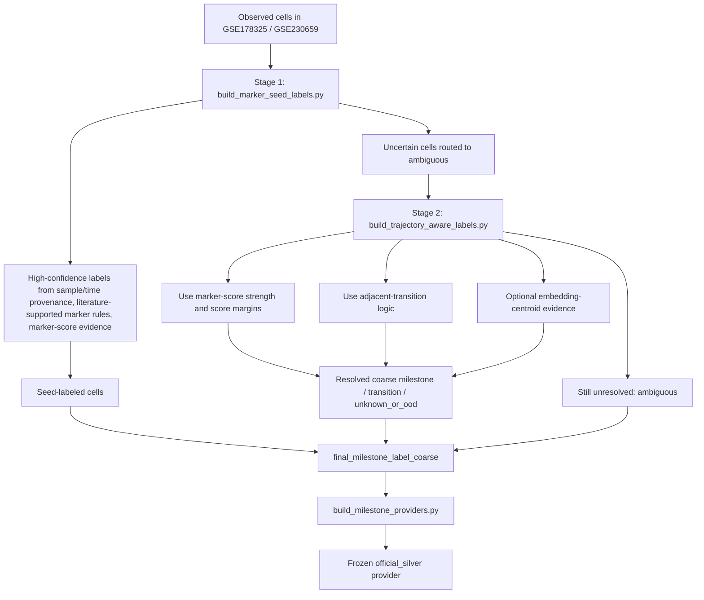

# 导师汇报材料：scTimeBench-aligned iPSC / OSKM trajectory benchmark

这份材料用于向导师介绍当前项目的设计逻辑，而不是单纯展示模型排名。建议汇报主线分三部分：

1. **项目背景介绍**：说明本项目主要参考了 *scTimeBench: A streamlined benchmarking platform for single-cell time-series analysis* 的框架，并在 iPSC / OSKM reprogramming 场景下做了哪些修改。
2. **实际使用的数据类型与可视化**：说明当前 benchmark 用了哪些单细胞时间序列数据、哪些 benchmark 输入文件、哪些 QC / 分布图可以展示。
3. **Silver standard 的设计逻辑和 metrics 使用方式**：说明为什么需要 frozen silver standard、各数据集如何构建 silver standard，以及 Forecast / Embedding / Lineage metrics 如何利用这些 silver standard。

---

## 1. 项目背景介绍

### 1.1 研究问题

单细胞 reprogramming 数据通常是时间序列数据：细胞在不同时间点被采样，表达状态随着重编程过程变化。但是这类数据通常没有真实可观测的 cell lineage ground truth。也就是说，我们很难直接知道每个细胞真实来自哪个前体细胞、最终走向哪个命运分支。

因此，本项目要解决的问题不是简单地“复现某个 trajectory 方法”，而是：

> 如何在没有真实 lineage ground truth 的情况下，为 iPSC / OSKM reprogramming 单细胞时间序列构建一个可复现、可比较、对不同方法公平的 benchmark？

这个问题涉及三个层面：

| 层面 | 具体问题 | 对应 benchmark 维度 |
|---|---|---|
| 表达分布预测 | 方法生成的未来或 held-out 时间点细胞，是否接近真实观测细胞？ | Forecast Accuracy |
| 状态结构保持 | projected cells 在 embedding space 中是否仍然保留合理的细胞状态结构？ | Embedding Coherence |
| 谱系结构恢复 | 方法预测的 state transition 是否接近一个固定的 reference lineage graph？ | Lineage Fidelity |

这三个问题不能合并成一个简单 accuracy。一个方法可能很好地生成未来表达分布，但不一定恢复正确的状态转移；另一个方法可能不能生成未来细胞，但能给出有用的 lineage transition structure。

---

### 1.2 与 scTimeBench 的关系

本项目主要参考的框架是：

> **scTimeBench: A streamlined benchmarking platform for single-cell time-series analysis**

scTimeBench 提供了一个核心思路：不要只用一个任务评价单细胞时间序列方法，而是从多个维度评估模型是否能处理 temporal single-cell data。本项目保留了 scTimeBench 的三个顶层评价维度：

1. **Forecast Accuracy**
2. **Embedding Coherence**
3. **Lineage Fidelity**

本项目没有直接复制 scTimeBench，而是在其框架上做了面向 iPSC / OSKM reprogramming 的适配。

### 1.3 本项目在 scTimeBench 基础上的修改

| 设计层面 | scTimeBench 提供的思想 | 本项目的修改 |
|---|---|---|
| 评价维度 | 使用 Forecast / Embedding / Lineage 多维度评价 | 保留三类评价维度，但将 annotation-dependent 部分改为 milestone-based silver standard |
| 数据对象 | 单细胞时间序列 benchmark 数据 | 换成 GSE230659、GSE178325、GSE242424 等 iPSC / OSKM reprogramming 数据 |
| 状态系统 | 需要 cell states / labels 支持 embedding 和 lineage 评价 | 构建 frozen official-silver milestone providers |
| Reference graph | 需要 reference lineage 用于 lineage fidelity | 为每个数据集构建 dataset-specific reference graph |
| 方法适用性 | 不同方法支持的输出不同 | 显式使用 capability gating，避免把方法强行放入不支持的任务 |
| 输出汇总 | 多指标、多任务汇总 | 在同一 dataset / scenario / provider / label mode 内排名，避免混合不同 reference scale |

最核心的修改是：**scTimeBench 的 metric framework 被保留，但 biological state system 被替换成适合本项目数据的 frozen silver milestone system。**

---

### 1.4 为什么需要 capability-gated evaluation

不同 trajectory 方法能输出的结果不同，因此不能强行让所有方法都接受同一套评价。

| Method | 能否生成未来时间点 projected cells | 能否做 lineage transition inference | 本项目评价维度 |
|---|---:|---:|---|
| MIOFlow | yes | yes | Forecast + Embedding + Lineage |
| PRESCIENT | yes | yes | Forecast + Embedding + Lineage |
| scNODE | yes | yes | Forecast + Embedding + Lineage |
| WOT | no | yes | Lineage only |
| CellRank2 | no | yes | Lineage only |

这里的逻辑是：

- 如果方法能生成 projected expression / projected cells，就可以评价 Forecast Accuracy 和 Embedding Coherence。
- 如果方法只能产生 transport map、transition matrix 或 fate / lineage 相关输出，就只评价 Lineage Fidelity。
- 不为了“表面公平”给 WOT / CellRank2 人为加 projection adapter，因为那样评价的可能是 adapter，而不是原方法。

汇报时可以这样说：

> 我们不是要求所有方法做同一件事，而是根据方法本身能输出什么来决定评价什么。这样可以避免为了统一比较而制造伪任务。

---

## 2. 实际使用的数据类型与数据可视化

### 2.1 本项目实际使用的数据类型

当前项目中的数据可以分成四类：

| 数据类型 | 文件 / 输出形式 | 用途 |
|---|---|---|
| post-QC scRNA-seq time-series input | `.h5ad`，HVG2000 expression matrix，obs 中包含 `abs_day` / stage / time label | 模型训练、projection、forecast evaluation |
| frozen silver labels | `state_labels.tsv`，`state_metadata.tsv` | 给 observed cells 定义 benchmark state system |
| frozen reference graph | `reference_graph.json`，`reference_graph_edges.csv` | Lineage Fidelity 的评价目标 |
| method outputs | `projected_expression.npy`，`projected_embedding.npy`，`state_transition_matrix.csv`，metrics JSON/CSV | 计算 Forecast / Embedding / Lineage metrics |

本项目目前主要使用 **HVG2000** 特征空间。这样做的原因是：

- 保持不同方法输入维度一致；
- 降低模型训练和评估的计算成本；
- 让 projected expression、embedding 和 downstream annotation 在同一 gene universe 下进行；
- 避免不同方法因为输入基因数不同而产生不公平比较。

限制也需要说明：HVG2000 不是 full transcriptome，某些 rare-state marker 可能被弱化。因此这些结果应理解为 benchmark comparison，而不是完整生物学解释。

---

### 2.2 当前纳入的单细胞时间序列数据集

| Dataset | Biological system | Benchmark role | 当前使用的细胞数 | 时间信息 | Provider |
|---|---|---|---:|---|---|
| GSE230659 | human chemical iPSC reprogramming | primary benchmark | 75,194 official-silver labeled cells | 15 stage/day labels in QC summary | `gse230659_marker_fm_transition_silver_v1` |
| GSE178325 | human iPSC reprogramming validation data | external validation | 80,475 official-silver labeled cells | 15 stage/day labels in QC summary | `gse178325_marker_fm_transition_silver_v1` |
| GSE242424 | OSKM fibroblast reprogramming | OSKM extension | 59,187 author-cluster-matched cells; 156,969 local QC-pass cells | 9 timepoints: D0, D2, D4, D6, D8, D10, D12, D14, iPSC/D16 | `gse242424_oskm_reprogramming_silver_v1` |

GSE242424 需要特别说明：正式 silver benchmark 使用的是 **59,187-cell author-cluster-matched subset**，不是完整 156,969-cell local QC-pass dataset。完整数据用于说明数据规模和 QC，matched subset 用于 formal silver evaluation。

---

### 2.3 GSE230659 数据可视化

**展示目的：**说明 primary benchmark 数据具有时间结构，同时检查不同 stage/timepoint 的细胞数量和潜在不均衡。


可以汇报：

- GSE230659 有 75,194 个 official-silver labeled cells。
- QC summary 覆盖 15 个 stage/day labels。
- PCA by time 用于直观看时间轴是否在表达空间中形成连续或分段结构。
- cell counts per timepoint 用于讨论 timepoint imbalance 是否会影响 forecast / lineage evaluation。

---

### 2.4 GSE178325 数据可视化

**展示目的：**说明 external validation 数据不是同一个数据集上的重复实验，而是用于检查 benchmark 逻辑能否迁移到另一个 iPSC reprogramming 数据。


可以汇报：

- GSE178325 有 80,475 个 official-silver labeled cells。
- 与 GSE230659 一样，使用 marker-FM transition silver provider。
- 该数据集包含 `xen_like` milestone，因此 reference graph 与 GSE230659 不完全相同。

---

### 2.5 GSE242424 数据可视化

**展示目的：**说明本项目不只适用于 chemical iPSC reprogramming，也能扩展到 OSKM fibroblast reprogramming。GSE242424 的 biological state system 更复杂，包含 productive、partial、stalled 和 off-target branches。


可以汇报：

- local GSE242424 h5ad 中有 156,969 个 QC-pass cells。
- 通过 author ATAC-to-RNA cluster transfer table 匹配得到 59,187 个 cells 用于 formal silver benchmark。
- 该 provider 有 10 个 coarse milestones 和 9 条 reference edges。
- iPSC endpoint 在 local QC-pass 数据中很多，但 matched subset 中只有 3,125 个 iPSC cells，这一点需要作为解释 caveat。

---

## 3. Silver standard 的构建逻辑

这一部分要按照 `experimental framework v2.md` 中 **9.3.2 Active official-silver provider strategy** 来讲。核心不是“我们有几个 label 文件”，而是：

> 本项目的 annotation-dependent benchmark 只使用一层冻结的 `official_silver` milestone provider；它取代了早期 scGPT pseudostate graph，也不再把 `consensus`、`embedding_based`、`classifier_based` 三套 provider 作为 primary benchmark。

换句话说，silver standard 是一个**正式注册、版本冻结、由 registry 调用的 benchmark reference layer**。它负责给每个数据集定义统一的 state label 和 reference graph，使 Embedding Coherence 与 Lineage Fidelity 可以在同一个状态系统下比较不同方法。

---

### 3.1 一句话说明 silver standard 是什么

Silver standard 不是 biological ground truth，也不是模型输出的一部分。它是我们为了让 benchmark 可执行、可复现、可比较而冻结下来的 reference：

```text
observed cells
    -> assign / transfer milestone labels
    -> freeze final_milestone_label_coarse
    -> register official_silver provider
    -> metrics read labels + reference graph from registry
```

汇报时可以这样解释：

> 因为真实 lineage ground truth 不存在，我们不能直接证明模型恢复了真实发育轨迹；所以我们构建一个 frozen official-silver milestone system，作为所有 annotation-dependent metrics 的共同参照。

---

### 3.2 当前 primary benchmark 只承认 active official-silver provider

目前正式 benchmark 不再使用早期设计中的 scGPT pseudostate silver standard，也不再生成三套候选 provider：

| 早期/历史设计 | 当前是否用于 primary benchmark | 原因 |
|---|---|---|
| scGPT pseudostate graph | 否 | 它属于早期探索路线，不再作为正式 reference |
| `consensus` provider | 否 | 不再作为当前 active provider-generation 逻辑 |
| `embedding_based` provider | 否 | 避免用 embedding-derived labels 反过来评价 embedding |
| `classifier_based` provider | 否 | 不作为当前 primary benchmark 的正式标签来源 |
| `official_silver` provider | 是 | 当前唯一 active annotation-dependent reference layer |

因此，所有正式报告和 ranking table 必须带上：

```yaml
ground_truth:
  label_mode: official_silver
  state_key: final_milestone_label_coarse
  exclude_uncertain_states: true
```

这一步的目的很关键：**任何分数都必须知道自己是在哪个 dataset、scenario、provider、label mode 下算出来的**，否则不同版本的 reference 会被混在一起，ranking 就没有解释力。

---

### 3.3 GSE178325 / GSE230659 的 marker-FM official-silver 构建流程

GSE178325 和 GSE230659 使用同一类 active provider strategy：先用 marker / time / sample provenance 产生 seed labels，再用 trajectory-aware 规则处理不确定细胞，最后冻结 provider。



这条流程的逻辑是：

1. **先保守地给高置信细胞打标签。** Stage 1 只给 marker、时间来源、样本信息都比较支持的细胞分配 milestone labels；不能可靠判断的细胞先进入 `ambiguous`。
2. **再处理灰区细胞。** Stage 2 不直接丢弃所有不确定细胞，而是结合 marker-score 强度、分数 margin、相邻 transition 关系和可选 embedding-centroid evidence，尽量把一部分细胞解析到 coarse milestone 或 transition state。
3. **最后冻结一个正式 provider。** `build_milestone_providers.py` 使用 `final_milestone_label_coarse` 生成 frozen provider assets。当前实现只生成 `official_silver` provider，不再生成历史的 `consensus`、`embedding_based`、`classifier_based` provider modes。

---

### 3.4 两个 marker-FM provider 的 active reference graph

GSE178325 的 active primary milestone graph 是：

```text
hADSCs -> epithelial_like -> intermediate_plastic -> xen_like -> hCiPS
```

GSE230659 的 active primary milestone graph 是：

```text
hADSCs -> epithelial_like -> intermediate_plastic -> hCiPS
```

对应的 active registered providers 是：

| Dataset | Active provider | State key | 不确定标签处理 |
|---|---|---|---|
| GSE178325 | `gse178325_marker_fm_transition_silver_v1` | `final_milestone_label_coarse` | `ambiguous` / `unknown_or_ood` excluded |
| GSE230659 | `gse230659_marker_fm_transition_silver_v1` | `final_milestone_label_coarse` | `ambiguous` / `unknown_or_ood` excluded |

这两个 provider 共同使用：

```text
label_mode: official_silver
label_type: frozen_silver_standard
state_key: final_milestone_label_coarse
```

需要说明的 caveat：

- GSE230659 的 reference graph 保留 `hADSCs` 作为 conceptual starting milestone；但 observed label file 中当前实际出现 3 个 observed label classes，因为可用最早时间点不是 Day 0。
- `ambiguous` 和 `unknown_or_ood` 不进入 official metrics，避免不确定标签影响正式 ranking。

---

### 3.5 GSE242424 的 OSKM official-silver provider 是单独构建的

GSE242424 不能复用 GSE178325 / GSE230659 的 chemical-reprogramming graph，因为它研究的是 OSKM-induced human fibroblast reprogramming。它的 active provider 是：

```text
gse242424_oskm_reprogramming_silver_v1
```

这个 provider 同样注册为：

```text
label_mode: official_silver
state_key: final_milestone_label_coarse
label_type: frozen_silver_standard
```

但它**不是**由 GSE178325 / GSE230659 的 marker-FM transition workflow 产生的，而是基于作者发布的 cluster annotation 与 ATAC-to-RNA cluster transfer。实际进入 formal silver benchmark 的是 59,187 个 author-cluster-matched cells。

Author cluster 到 coarse milestone 的 frozen mapping 是：

```text
C1        -> fibroblast
C2-C5     -> fibroblast_like_stalled
C6        -> keratinocyte_like
C7        -> hOSK
C8        -> xOSK
C9        -> partial_intermediate
C10       -> partially_reprogrammed
C11-C12   -> primary_intermediate
C13-C14   -> pre_iPSC
C15       -> iPSC
```

Reference graph 是：

```text
fibroblast -> fibroblast_like_stalled
fibroblast -> keratinocyte_like
fibroblast -> hOSK -> partial_intermediate -> partially_reprogrammed
fibroblast -> xOSK -> primary_intermediate -> pre_iPSC -> iPSC
```

这个 graph 的设计目的不是只保留一条 successful reprogramming path，而是同时保留：

- productive path：`fibroblast -> xOSK -> primary_intermediate -> pre_iPSC -> iPSC`
- partial / stalled path：`fibroblast -> hOSK -> partial_intermediate -> partially_reprogrammed`
- off-target / stalled branches：`fibroblast_like_stalled`、`keratinocyte_like`

因此，GSE242424 的 silver standard 更适合评价 OSKM reprogramming 中“模型是否能区分成功重编程、中间停滞和偏离分支”。

---

### 3.6 Provider assets 和 registry 的作用

每个 active provider 最终都被写成一组冻结文件，并在 registry 中登记：

| 文件 | 作用 |
|---|---|
| `state_labels.tsv` | 每个 observed cell 的 `final_milestone_label_coarse` |
| `state_metadata.tsv` | 每个 milestone state 的 metadata |
| `reference_graph_edges.csv` | directed state-level reference edges |
| `reference_graph.json` | reference lineage graph |
| `ground_truth_metadata.json` | provider ID、label mode、版本和 provenance |
| `annotation_votes.tsv` | label assignment / transfer / voting 的记录 |

Registry 的作用是把 benchmark 的 reference 固定下来：

```text
dataset + provider_id + label_mode + state_key + reference_graph
```

之后所有 metrics 都从 registry 读取同一套 labels 和 graph。这样做的好处是：

- 不同方法不会使用不同 label system；
- 同一个方法在不同 provider version 下的结果不会被混合；
- ranking 只能在相同 `(dataset, scenario, result_class, ground_truth_provider, label_mode)` 分组内比较；
- 如果未来要改进 annotation，只新增 provider version，而不是覆盖当前 frozen provider。

---

## 4. 如何利用 silver standard 进行 metrics

### 4.1 Forecast Accuracy：不依赖 silver labels

Forecast Accuracy 回答的问题是：

> 预测出来的未来时间点表达分布，是否接近真实观测到的目标时间点表达分布？

它使用 projected expression 与 observed expression 直接比较，不需要 silver labels。

| Metric | 越大/越小越好 | 想说明什么 |
|---|---|---|
| Wasserstein Distance | lower better | predicted distribution 到 observed distribution 的 transport-style 距离 |
| Gaussian MMD | lower better | Gaussian kernel space 下两个表达分布是否相似 |
| Energy Distance MMD | lower better | 更全局的 distribution discrepancy |
| Hausdorff Loss | lower better | 最坏情况下 projected cells 与 observed cells 的最近邻距离 |

使用方式：

```text
method projected_expression.npy
        vs
observed cells at target timepoint
        ->
Forecast Accuracy metrics
```

解释边界：

- Forecast Accuracy 高，说明 projected expression distribution 更接近 observed distribution。
- 它不说明模型恢复了正确的 lineage direction。
- 它对 MIOFlow、PRESCIENT、scNODE 有意义；对 WOT / CellRank2 不适用。

---

### 4.2 Embedding Coherence：利用 silver labels 评价 projected embedding 的状态结构

Embedding Coherence 回答的问题是：

> 方法生成的 projected cells 在 embedding space 中，是否还能形成与 silver milestone labels 对应的结构？

本项目采用 scTimeBench-style 逻辑，但 label system 换成 official-silver milestone labels：

```text
projected_embedding.npy
        ->
kNN graph + Leiden clustering
        ->
unsupervised projected-cell clusters
        vs
official_silver final_milestone_label_coarse
        ->
ARI / entropy
```

为什么不直接用 projected milestone labels 做比较：

- 如果 projected labels 本身已经由 milestone annotation 得到，再与 milestone labels 比较，会形成 self-comparison artifact。
- 因此 official evaluator 从 method output 的 `projected_embedding.npy` 重新做 Leiden clustering，再与 frozen silver labels 比较。

Metrics:

| Metric | 越大/越小越好 | 想说明什么 |
|---|---|---|
| Adjusted Rand Index (ARI) | higher better | projected embedding 中的无监督 cluster 是否对应 silver milestone states |
| Mean normalized entropy | lower better | projected cells 的 state probability 是否更确定 |
| Weighted entropy | lower better | 在考虑类别或细胞权重后，annotation uncertainty 是否更低 |

解释边界：

- Embedding Coherence 高，说明 projected embedding 的状态结构更接近 silver state system。
- 它不直接说明 expression distribution 是否真实。
- 当前 ARI 绝对值不宜过度解释，后续最好加入 label permutation 或 random-clustering null。

---

### 4.3 Lineage Fidelity：利用 silver reference graph 评价 state transitions

Lineage Fidelity 回答的问题是：

> 方法预测的 state-level transition matrix / lineage graph 是否接近 frozen silver reference graph？

计算逻辑：

```text
method output
  - transport map / transition scores / simulated projected cells
        ->
aggregate by final_milestone_label_coarse
        ->
state_transition_matrix.csv
        vs
reference_graph_edges.csv
        ->
Lineage Fidelity metrics
```

Metrics:

| Metric | 越大/越小越好 | 想说明什么 |
|---|---|---|
| AUROC | higher better | 在所有 possible state pairs 中，reference edges 是否总体得到更高 score |
| AUPRC | higher better | 在 reference graph 稀疏时，高分边是否真正命中正边 |
| Jaccard top-k | higher better | predicted top-k edges 与 reference edges 的重叠程度 |
| Single-step recovery | higher better | reference graph 中直接相邻 transition 是否恢复 |
| Multi-step recovery | higher better | 较长路径或间接 lineage relation 是否恢复 |

解释边界：

- Lineage Fidelity 高，说明方法符合 frozen silver graph。
- 它不能单独证明方法恢复了真实 biological lineage。
- 如果 reference graph 本身有争议，Lineage Fidelity 的解释也会受影响。

---

### 4.4 Silver standard 如何进入不同方法

| 方法类型 | 方法输出 | silver standard 如何使用 |
|---|---|---|
| Generative / projected-cell methods：MIOFlow、PRESCIENT、scNODE | `projected_expression.npy`、`projected_embedding.npy`、projected cells | Forecast 用 expression；Embedding 用 projected embedding 与 silver labels；Lineage 将 projected / simulated results 聚合到 silver states |
| Transition-only methods：WOT、CellRank2 | transport map、fate probabilities、transition matrix | 只用于 Lineage Fidelity：把 cell-level transition 聚合到 silver states，再与 reference graph 比较 |

这就是 capability gating 与 silver standard 的结合：

- **Capability gating** 决定一个方法能进入哪些 evaluator。
- **Silver standard** 为 annotation-dependent metrics 提供 state labels 和 reference graph。

---

### 4.5 Ranking 如何避免混淆不同 reference

所有 ranking 都应限制在同一组条件内：

```text
dataset
scenario
result_class
ground_truth_provider
label_mode
```

原因是不同数据集、不同 provider、不同 reference graph 的 metric scale 不一样。比如 GSE242424 有 10 个 states / 9 条 edges，而 GSE230659 只有 4 个 graph states / 3 条 edges，不能直接把 raw AUROC / AUPRC 混在一起做总平均。

当前 ranking 规则：

1. 在同一 dataset / scenario / provider / label mode 内，对每个 metric 排名。
2. 同一个 metric family 内平均 rank，得到 Forecast / Embedding / Lineage rank。
3. 只有同时 eligible 的方法才进入 combined rank。
4. WOT / CellRank2 不进入 Forecast / Embedding / combined rank，只报告 Lineage Fidelity。

---

## 5. 汇报时建议强调的 caveats

1. **Silver standard 不是真实 biological ground truth。**  
   所有 Lineage Fidelity 结果都应表述为 performance against a frozen silver-standard temporal reference。

2. **GSE230659 的 hADSCs start node 需要导师判断。**  
   Reference graph 中有 hADSCs，但 observed label file 中没有 hADSCs label。

3. **GSE242424 只在 matched subset 上做 formal silver benchmark。**  
   不要把 59,187-cell matched subset 的结果和完整 156,969-cell local dataset 混为一谈。

4. **Embedding Coherence 的 ARI 需要 null。**  
   当前 ARI 更适合作为 relative diagnostic，不宜过度解释绝对值。

5. **方法排名目前缺少充分 seed variance。**  
   小的 rank difference 应描述为趋势，而不是统计上确定的胜负。

---

## 6. 可展示文件索引

| 内容 | 文件 |
|---|---|
| 项目总览 | `README.md` |
| Benchmark 说明 | `benchmark/README.md` |
| 主设计文档 | `experimental framework v2.md` |
| Method capabilities | `benchmark/configs/method_capabilities.yaml` |
| Provider registry | `benchmark/ground_truth/registry.yaml` |
| GSE242424 provider provenance | `GSE242424_frozen_reference_lineage_graph_README.md` |
| Official-silver ranking report | `benchmark/reports/official_silver/official_silver_model_rankings.md` |
| GSE242424 OSKM report | `benchmark/reports/gse242424_oskm_silver/gse242424_oskm_silver_report.md` |
| QC figures | `benchmark/reports/qc/` |
| GSE242424 figures | `benchmark/reports/gse242424_oskm_silver/figures/` |
